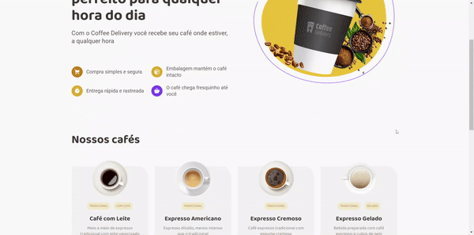

<!-- Logotipo -->
<div align="center">
  
</div>

<!-- Logo -->
<h1 align="center"> Coffee Delivery </h1>
<!-- Sobre o Projeto -->

## 🧐 Sobre o Projeto

Este projeto é um desafio proposto no curso do ignite, cujo objetivo é desenvolver uma aplicação para gerenciar um carrinho de compras de uma cafeteria fictícia, que contém as seguintes funcionalidades:

- Listagem de produtos (cafés) disponíveis para compra
- Adicionar uma quantidade específicas de itens no carrinho
- Aumentar ou remover a quantidade de itens no carrinho
- Formulário para o usuário preencher o seu endereço
- Exibir o total de itens no carrinho no Header
- Exibir o valor total da soma de itens no carrinho multiplicados pelo valor

## 🔥 Preview

Acesse o link: https://coffee-delivery-flax.vercel.app/

## 🚀 Tecnologias e Bibliotecas

- [ReactJS](https://reactjs.org/)
- [Typescript](https://www.typescriptlang.org/)
- [Styled Components](https://styled-components.com/)
- [JSON Server](https://www.npmjs.com/package/json-server)
- [Immer](https://github.com/immerjs/immer)
- [Phospor React](https://phosphoricons.com/)

## 💻 Rodando o Projeto

```bash
# Realize o Clone deste repositório
$ https://github.com/lucasbarque/CoffeeDelivery.git
# ou use a opção de download.
# Acesse a pasta do projeto
$ cd CoffeeDelivery
# Instale as dependências
$ yarn install
ou
$ npm install
# Executando o Projeto
$ yarn dev
ou
$ npm run dev
# Acesse http://localhost:3000 no seu navagador
```
